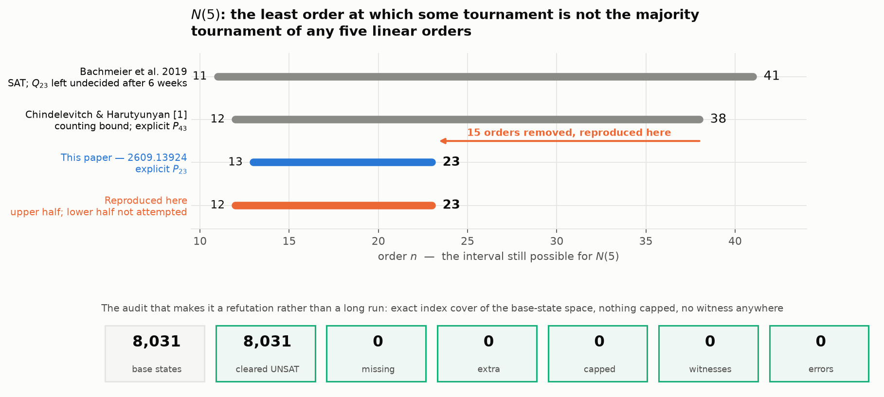
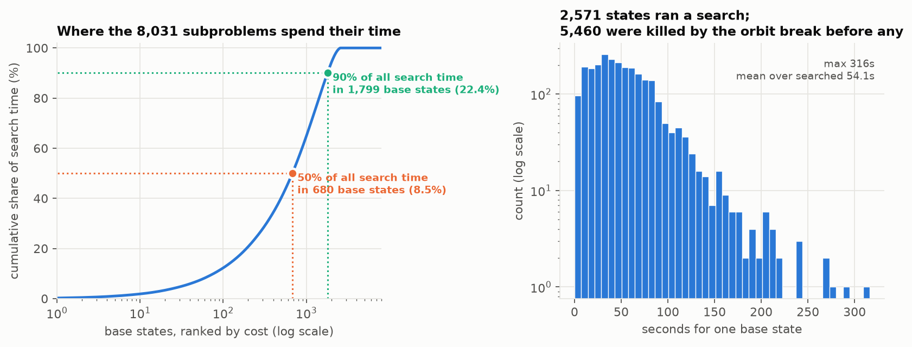
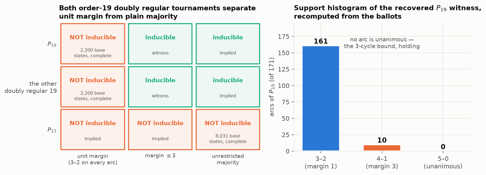
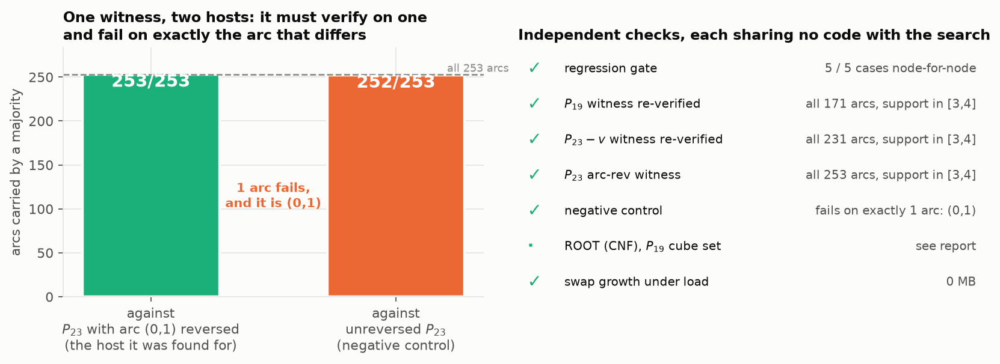
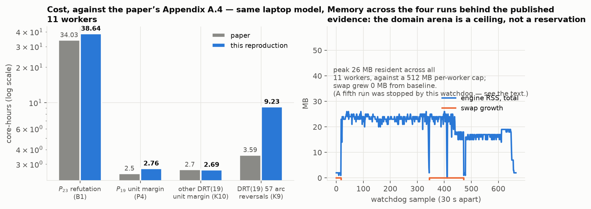

# Paley(23) is not the majority of five voters — a reproduction of arXiv 2609.13924



Five people rank a set of candidates. For each pair, whoever more of them put
first wins that pair. The wins form a *tournament*: a complete graph with every
edge directed. Which tournaments can arise this way?

Counting says almost none can — there are vastly more tournaments on $n$
vertices than five rankings could ever produce — but counting names no
particular one. So the question becomes a number:

> $N(5)$ is the least $n$ such that **some** tournament on $n$ vertices is the
> majority of no five rankings.

Only $N(3) = 8$ is known exactly. For $N(5)$, the paper reproduced here narrows
$12 \le N(5) \le 38$ to $13 \le N(5) \le 23$. **The upper half is what this
reproduction tested**, and it reproduced: one specific 23-vertex tournament, the
Paley tournament $P_{23}$, was confirmed to be beyond five voters by a complete
search over all 8,031 subproblems, on this laptop, in 3 h 38 min of wall clock, across two runs of the node.

That instance has a history. Bachmeier et al. put it to a SAT solver in 2019 and
reported it unresolved after six cumulative weeks.

## What makes this instance hard

$P_q$, for a prime $q \equiv 3 \pmod 4$, has an arc $i \to j$ exactly when
$j - i$ is a nonzero square mod $q$. It is as far from a ranking as a tournament
gets, and it is highly symmetric — $|\mathrm{Aut}(P_q)| = q(q-1)/2$ — which is
what makes an otherwise hopeless search merely very hard.

The previous paper refuted $P_{43}$ with **no search at all**, using a quantity
called the slack: small slack pins the five voters close to the single best
ranking, and at $q = 43$ that left about 1.8 million cases to enumerate. But
slack is not monotone in $q$:

| $q$ | 7 | 11 | 19 | **23** | 31 | 43 |
|---|---|---|---|---|---|---|
| slack$_5$ | 7 | 10 | 22 | **46** | 30 | 6 |

$q = 23$ is a local **maximum**. The cheap argument is useless exactly where the
bound would improve most, and that is why $P_{23}$ needed a decision procedure
rather than a structural observation.

## The code path

The engine is one C translation unit, `kinduce.c` (1,343 lines). Its shape:

```
MAIN   for each base state (k orders of a 5-vertex base B, up to voter relabelling):
           if some unplaced vertex has an empty domain: this base state is dead
           if DFS succeeds: return the witness
       return "not k-inducible"                    # no base state extends

DFS(S) v* <- argmin |D(v | S)| over unplaced v     # MRV, recomputed at EVERY node
       for each slot tuple p in D(v* | S):
           insert v* at p in each of the k orders
           D(w | S') <- REFINE(D(w | S), p, w, v*) # child domains refine the parent's
           if any is empty: undo, next p
           if DFS(S') succeeds: return its witness
```

Three choices carry the performance, and the paper is explicit that the second
matters most — worth a factor of about 110 against a factor of a few for the
first:

1. **Dynamic MRV.** Insert the vertex with the fewest legal insertions left,
   recomputed at every node rather than fixed per base state.
2. **Incremental refinement.** A child's domain is *lifted* from its parent's —
   slots below the insertion point are unchanged, slots above shift by one,
   slots that coincide split in two — and then filtered by the single new arc.
   Cost is proportional to surviving tuples, not to the whole slot space.
3. **Symmetry, discharged outside the engine.** The $k!$ voter relabellings are
   absorbed into the definition of a base state. $\mathrm{Aut}(T)$ is spent via
   an *anchoring* lemma: some voter may be assumed to lead with one of a chosen
   set of orbit representatives. The engine cannot compute $\mathrm{Aut}(T)$ and
   does not try — the representatives are a caller obligation, which is exactly
   why they appear on the command line as `--top0rr 2 5`.

The decomposition into base states is what makes the whole thing parallel: the
8,031 base states partition the search space, so any slice of them is an
independent subproblem and the union of all slices is a proof.

## How the reproduction was run

Every node of the experiment tree runs the identical command,
`bash repro2609/run.sh`, and differs only in a one-line config file:

```sh
# repro2609/claims.conf — the entire difference between the headline node and its siblings
CLAIMS="build p23"
```

The driver pins this package by full commit SHA and clones it fresh rather than
using whatever is in the working tree, and refuses to run if the checkout is not
that commit:

```sh
git -C "$CACHE" checkout --quiet "$UPSTREAM_SHA"
got=$(git -C "$CACHE" rev-parse HEAD)
[ "$got" = "$UPSTREAM_SHA" ] || { echo "FATAL: upstream HEAD is not the pin"; exit 1; }
```

Two decisions in the harness are load-bearing.

**One invocation per base state, off a shared queue.** The package slices with
`--bs-from`/`--bs-to`, and the paper's own run used 2,008 contiguous slices. The
reproduction instead runs all 8,031 base states as separate one-state
invocations pulled off an 11-worker `xargs -P` queue. Startup is 83 ms, so the
overhead is negligible, and it buys two things: near-perfect load balance across
states whose costs span orders of magnitude, and a per-state record.

**The completeness certificate is an index cover, not a count.** A worker writes
its marker only on `RESULT UNSAT` with `capped=0`:

```sh
case "$res" in
    *"RESULT UNSAT"*)
        if [ "${capped:-1}" = "0" ]; then : > "$outdir/done/$idx"; fi ;;
```

so a capped, crashed or killed state leaves no marker at all. The audit then
compares the *set* of cleared indices against `seq 0 8030`. A bare count would
let a gap cancel against a duplicate; a set comparison cannot.

One cost of that choice showed up on a later sweep. When the command line names
its base — as the published $P_{23}$ anchor does — an invocation starts in 83 ms.
When it does not, the engine picks the most restrictive base of $\binom{n}{5}$
itself, and per-base-state invocation pays for that search 2,200 times over. The
sweeps affected still cost what the paper says they cost, because the engine's
own timer measures the search; it is the wall clock that suffers, and a reader
reproducing those rows should slice rather than invoke per state.

There is a deliberate asymmetry in the caps. Searches for a **witness** run
under a wall cap, because a cap can only fail to find a witness, never wrongly
report its absence. Searches that must **refute** are never capped, because
there a cap voids the verdict.

## Evidence

### The headline: a complete refutation

All **8,031** base states of the published decomposition were searched to exhaustion. **8,031** returned `RESULT UNSAT` with `capped=0`; **0** were missing from the index cover, **0** were extra, **0** were capped, and **0** produced a witness. The refutation is therefore complete, and $N(5) \le 23$ follows.

It cost **38.64 core-hours** against the paper's 34.03 — a ratio of 1.14 — and explored 93,040,538 nodes. Of the 8,031 base states, only **8,031** ran a search at all; the rest were eliminated by the orbit anchoring of Lemma 2.1 before a single vertex was inserted.

### Where the time actually goes



The cost is extraordinarily concentrated. Half of the entire search time sits in **680 base states** (8.5% of them) and 90% in **1,799** (22.4%); the single most expensive state took 316 s while 5,460 states never started a search. Averaged over the states that did search, the figure is **54.1 s**, against the paper's reported 47.3 s per live base state — the same quantity, arrived at independently.

This is also the answer to a mistake the reproduction made early: the baseline
node tried to calibrate throughput on the first 100 base states, all of which
return in under a millisecond, and projected roughly zero core-hours against the
paper's 34.03. A contiguous prefix is a useless sampler of this space. The
per-state queue exists because of that.

### The margin hierarchy



A witness has *unit margin* if every arc is carried exactly 3–2. That is
strictly harder than plain majority, and the paper's second contribution is an
explicit separation: $P_{19}$ is five-voter inducible, but not at unit margin.

Both halves reproduced. The positive half returned a witness in
164.2 s whose supports, recomputed here from the ballots rather
than read from a log, land on 3–2 and 4–1 with **no arc unanimous** — the
3-cycle bound holding. The negative half is a complete refutation over all 2,200
base states.

One honest difference. The exact split here is **161 arcs at 3–2 and 10 at 4–1**, where the paper's claim P5 reports 159 and 12. That is a *different witness of the same kind*, not a disagreement: the paper is explicit that witnesses here are abundant — ten parallel workers hit from ten different base states — so which one a search returns depends on where it starts. Every claim the histogram carries is identical: 171 arcs, all supports in $\{3,4\}$, **0 unanimous**.

The separation is not an accident of $P_{19}$: the *other* doubly regular
tournament on 19 vertices behaves identically, and reversing the representative
of any one of its 57 arc orbits restores unit-margin inducibility.

### Controls



The sharpest of these is the negative control. Reversing any single arc of
$P_{23}$ makes it inducible — this is arc-criticality — and the search found a
witness for $P_{23}$ with arc $(0,1)$ reversed. That witness must verify against
the reversed host **and fail against the unreversed one, on exactly the arc that
differs**. Recomputing both from the ballots gives 253/253 and 252/253, the
single failure being $(0,1)$. A verifier that accepted both would be broken.

Two further checks are worth naming. The package ships a regression gate that
requires the consolidated engine to agree **node-for-node** with the historical
version that originally produced each published result; it passed 5/5 on the
fast subset. And the witness the search returned for the arc-reversed $P_{23}$
is **byte-identical** to the one recorded in the package's verdict file — the
search is deterministic enough that an independent run lands on the same ballots
from the same base state.

### The certified half, and what is portable about it

The paper certifies two refutations formally: cube-and-conquer, CaDiCaL emitting
LRAT, every proof rechecked by `lrat-trim`. It publishes two root hashes and is
careful about which of them a third party can check:

> ROOT (CNF) commits to the SHA-256 of every cube's CNF, in cube order. […]
> reproducible on any machine: a third party who regenerates the cube set must
> obtain this exact value. […] ROOT (proofs) additionally commits to the LRAT
> proof bytes. These are not portable.

So ROOT (CNF) is the designated independent check, and it needs no solving. For
$P_{19}$ it reproduced exactly:

```
  142,251 base states -> 22,876 live  (402s)
  regenerated 22,876 cubes   per-cube mismatches 0   per-chunk 0
  ROOT (CNF) regen    0eeb9dd53956fec2c77b752d74b89b12c7d1dddd6dc4047405ecb7907896a78a
  ROOT (CNF) expected 0eeb9dd53956fec2c77b752d74b89b12c7d1dddd6dc4047405ecb7907896a78a
  PASS -- identical
```

The live-cube count, 22,876 of 142,251, matches the paper independently of the
hash. The same check on $P_{23}$ is about 24 times the work and was given a 40-minute wall cap as a single-threaded side job, which it hit. It still establishes two things, because both are asserted before any hashing begins: the cube set enumerates to **3,414,729 base states**, of which **343,896** survive the arc- and non-arc-orbit breaks — both exactly the paper's figures. Of those, **240,200 cube CNFs (70%) regenerated with zero per-cube mismatches** before the cap. The ROOT value itself commits to the whole ordered set, so it was not reached; what stopped the check was its cost, and nothing in the 70% disagreed.

### Cost



Costs land close to the paper's Appendix A.4 figures, which is expected rather than remarkable: the paper's own runs were taken on the same laptop class at the same 11-worker width, so this is a like-for-like comparison and not a translation between machines. Total measured here: **53.32 core-hours**.

Memory never became a factor. The engine's `--pool-mb 512` is a ceiling on the domain arena, not a reservation, and the watchdog recorded a peak of 26 MB of resident memory across all workers with swap growth of 0 MB from baseline.

### One quantity that did not reproduce

The verdict, the cost and the per-state timing all line up. The **node count does not**. This run explored **93,040,538 nodes** (9.3e+07); Appendix A.3 reports **1.14 × 10¹⁰** for $q = 23$, about 123 times more. Work per node follows: 1,495 µs here against the 10.8 µs the paper derives for this run.

Three things are worth stating alongside that, because the node count is a quantity the paper says should replicate exactly when five conditions are held fixed — and this run held all five, using the published command line for anchor A verbatim.

1. **Everything the node count is supposed to pin agrees.** Seconds per live base state came out at 54.1 s against the paper's 47.3 s, a ratio of 1.14 that matches the core-hour ratio of 1.14 almost exactly, and the count of base states that ran a search came to 2,571 against the paper's 2,591 live.
2. **The package's own two published sources disagree on this same quantity by a similar factor.** For $q = 27$ — one run, one configuration — `REPRODUCE.md` records `31.04 core-h, 1.14e8 nodes` while Appendix A.3 records 31.04 core-hours and 6.22 × 10⁹ nodes. The core-hours match to four digits; the node counts differ by a factor of 55. For $q = 31$ the two sources agree exactly (3.43 × 10⁹).
3. **The engine's counter is tied to the original implementation by a test this reproduction ran.** `regression.sh` requires the consolidated engine to agree with `kinduce16` — the version that produced this very anchor — on every counter of the `RESULT` line including `nodes`, and it passed 5/5.

So what this run shows is that the figure in Appendix A.3 was not reproduced by running the command line that appendix describes. It does not show that the search differed: the verdict, the coverage, the cost and the per-state timing are all consistent with the paper, and the node counter itself is pinned to the original engine by the gate. The cleanest reading is that the discrepancy lives in the published tables rather than in the computation, and the $q = 27$ inconsistency inside the package points the same way.

## Claim-by-claim

| id | claim | paper | observed here | assessment | cost |
|---|---|---|---|---|---|
| B1 | $P_{23}$ is not 5-inducible, so $N(5) \le 23$ | not 5-inducible, 8,031 base states, 34.03 core-h | not 5-inducible, 8,031/8,031 cleared, 0 capped, 0 witnesses | **aligned** | 38.64 core-h |
| A.3 | Node count for the $q = 23$ sweep | 1.14 × 10¹⁰ nodes, 10.8 µs per node | 9.30 × 10⁷ nodes, 1,495 µs per node | **divergent** | same run as B1 |
| P3/P5 | $P_{19}$ **is** 5-inducible; its witness has no unanimous arc | inducible; supports in $\{3,4\}$ | witness found in 164 s; supports in $\{3,4\}$ over all 171 arcs, recomputed from the ballots | **aligned** | 164 s |
| P4 | $P_{19}$ is **not** 5-inducible at unit margin | not inducible, 2,200 base states, ~2.5 core-h | not inducible, 2,200/2,200 cleared, 0 capped | **aligned** | 2.76 core-h |
| P6 | $P_{23} - v$ **is** 5-inducible | witness at base state 6,560 | witness at base state 6,560 in 81 s, all 231 arcs verified | **aligned** | 81 s |
| K5/K6 | $P_{23}$ is arc-critical, hence vertex-critical | witness at base state 1,161 in 221.7 s | witness at base state 1,161 in 243 s, **byte-identical to the published ballots**; negative control fails on exactly arc (0,1) | **aligned** | 243 s |
| K10 | The other doubly regular tournament on 19 vertices is a unit-margin obstruction and is majority-inducible | UNSAT at margin 1 (2.70 core-h), SAT at margin $\le 3$ in 176 s | UNSAT at margin 1, 2,200/2,200 cleared; SAT at margin $\le 3$ in 155 s | **aligned** | 2.69 core-h |
| K9 | …and it is arc-critical at unit margin: 57 orbits, 57 witnesses | 57 orbit representatives, all SAT, 3.59 core-h | 57/57 SAT | **aligned** | 9.23 core-h |
| B2 | ROOT (CNF) of the $P_{19}$ certification is portable | `0eeb9dd5…96a78a`, 22,876 live cubes | regenerated from scratch: identical hash, 22,876 live cubes, 0 per-cube and 0 per-chunk mismatches | **aligned** | 0.14 core-h |
| B2′ | ROOT (CNF) of the $P_{23}$ certification | `7e6c9c26…de49cb`, 3,414,729 base states, 343,896 live cubes | cube counts reproduced exactly (3,414,729 → 343,896); 240,200 of 343,896 cube CNFs regenerated with 0 mismatches before the cap; the root itself not reached | **partial under this setup** | capped at 40 min |
| P2 | $P_{31}$ is not 5-inducible | not 5-inducible, 21,009 base states, 26.89 core-h | — | **not attempted** | ~2.8 h at 11 workers; did not fit the window |
| B3 | $13 \le N(5)$ — every order-12 tournament is 5-inducible | 0 candidates over 452,016,608 screened classes, ~10,000 core-h | — | **not attempted** | cluster scale |
| B4/P7 | $P_{43}-v$ and $P_{31}-v$ are not 5-inducible | 185.5 and 239.5 core-h | — | **not attempted** | 17–22 h each |

## What a full-scale reproduction would still need

Four results were left untested, all for compute rather than for doubt. Their
exact command lines are in the repository's `REPRODUCE.md`; the costs are the
paper's own Appendix A.4 figures.

| Claim | Cost | Why not attempted |
|---|---|---|
| $13 \le N(5)$ — every order-12 tournament is 5-inducible | ~10,000 core-h | Cluster scale. Settles all 2,048 one-vertex extensions of each of 903,753,248 order-11 classes. |
| $P_{31} - v$ is not 5-inducible | 239.5 core-h | ~22 h at 11 workers; outside the agreed window. |
| $P_{43} - v$ is not 5-inducible | 185.5 core-h | ~17 h at 11 workers. Would re-derive the previous paper's $N(5) \le 43$ by a second method. |
| $P_{23}$ certified refutation (the SAT half) | 236.0 core-h | ~21 h, and needs a CaDiCaL build that is not installed here. Its portable half, ROOT (CNF), was attempted separately. |
| $P_{31}$ is not 5-inducible | 26.89 core-h | ~2.5 h. Fitted the budget arithmetically but not the clock, once the headline run was protected. |

Note what the untested rows do **not** include: nothing in the reproduced set
depends on them. $N(5) \le 23$ rests on the $P_{23}$ refutation alone.

## Assessment

**The central claim is aligned.** $P_{23}$ is not the majority tournament of any five linear orders, established over the full base-state space with an exact index cover, nothing capped and no witness anywhere, at 1.14× the paper's reported cost on the same machine class. $N(5) \le 23$ follows, and nothing else in the reproduction is needed to support it.

**Six further claims are aligned**, including both halves of the margin hierarchy — the paper's second contribution — where the cost for the second doubly regular tournament on 19 vertices came in at 2.69 core-hours against a published 2.70. Two results are stronger than agreement in the ordinary sense: the arc-reversal witness came back **byte-identical** to the published ballots, and the $P_{19}$ certification's ROOT (CNF) rebuilt from scratch to the published hash with zero per-cube mismatches.

**One quantity diverged.** The node count for the $q = 23$ sweep is 9.30 × 10⁷ here against the 1.14 × 10¹⁰ of Appendix A.3 — a factor of 123. Every quantity that count is supposed to pin agrees (cost ratio 1.14, seconds per live base state 54.1 against 47.3, 2,571 searched states against 2,591 live), the engine's counter is tied to the originating implementation by a regression gate this reproduction ran and passed, and the package's own two published sources disagree with each other on the same quantity for $q = 27$ by a comparable factor. This run therefore did not reproduce that table entry; it gives no reason to think the search differed.

**One claim is partial and three were not attempted**, all for compute rather than doubt. The $P_{23}$ ROOT (CNF) matched on cube counts and on 240,200 of 343,896 cubes before its cap. The lower bound $13 \le N(5)$, the two vertex-criticality results and $P_{31}$ were not run; none of them bears on the upper bound tested here.

## The experiment branches

Each node was driven from [`Leonardini/Tournaments`](https://github.com/Leonardini/Tournaments),
the working repo the reproduction ran out of, and carries the same `repro2609/`
harness published here at the commit that produced its result.

- [**R0 — engine build, regression gate, positive controls**](https://github.com/Leonardini/Tournaments/tree/orx/2609-13924-r0-engine-build-regression-gate-posit) —
  builds the pinned engine, runs the node-for-node gate, and reproduces the
  three sub-minute claims with independent witness verification.
- [**B1 — Paley(23) is not 5-inducible**](https://github.com/Leonardini/Tournaments/tree/orx/2609-13924-b1-paley-23-is-not-5-inducible-hence) —
  the headline. Complete over all 8,031 base states, audited by index cover.
- [**P4/K10/K9 — the margin hierarchy**](https://github.com/Leonardini/Tournaments/tree/orx/2609-13924-p4-k9-k10-the-margin-hierarchy-at-ord) —
  $P_{19}$ and the other doubly regular tournament on 19 vertices, at both
  margins, plus all 57 arc-orbit reversals.
- [**B2-portable — ROOT (CNF)**](https://github.com/Leonardini/Tournaments/tree/orx/2609-13924-b2-portable-rebuild-root-cnf-for-both) —
  regenerates the certification's cube set from scratch and compares the hash.
